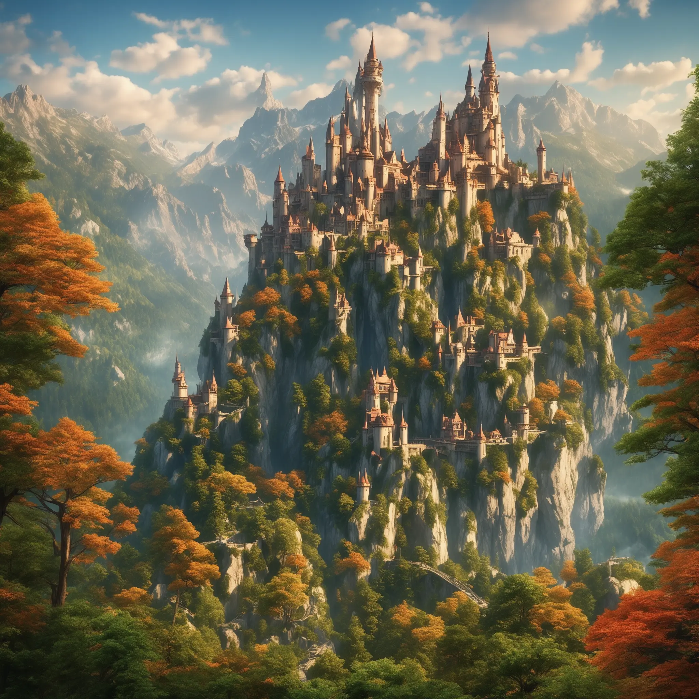
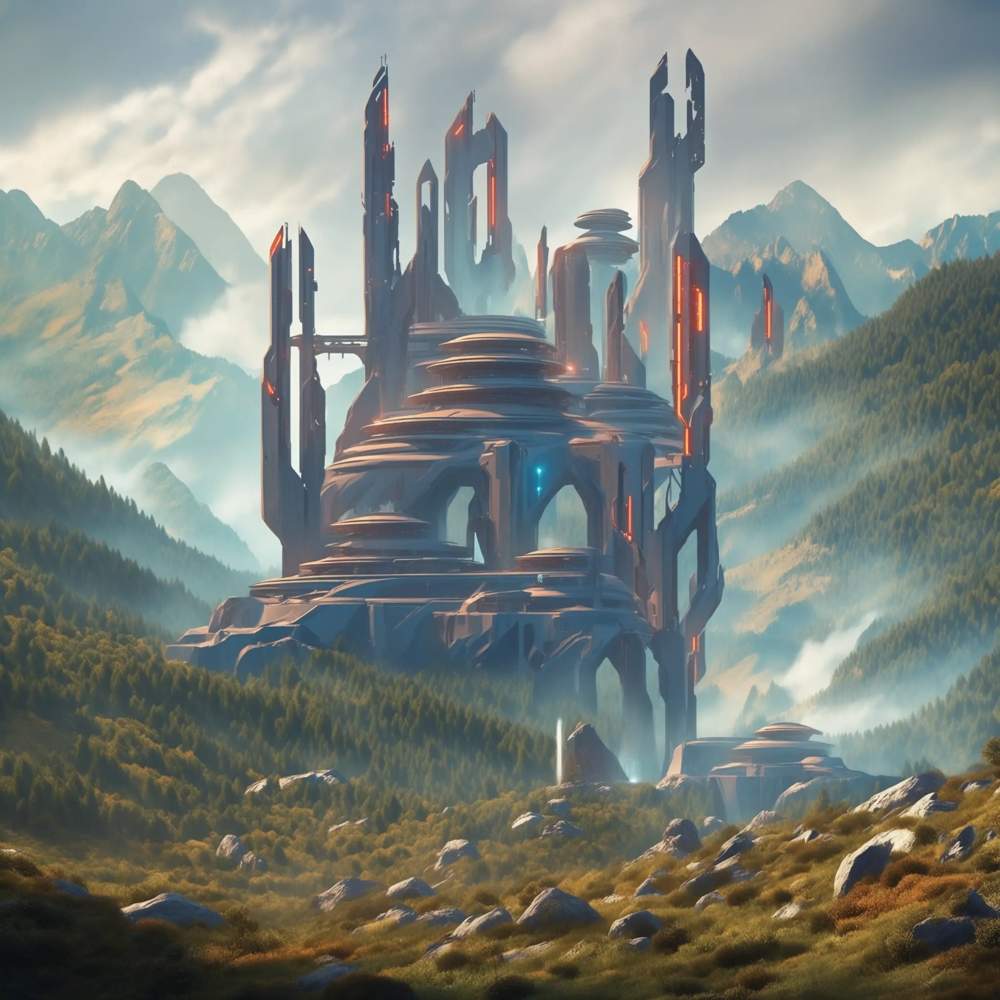
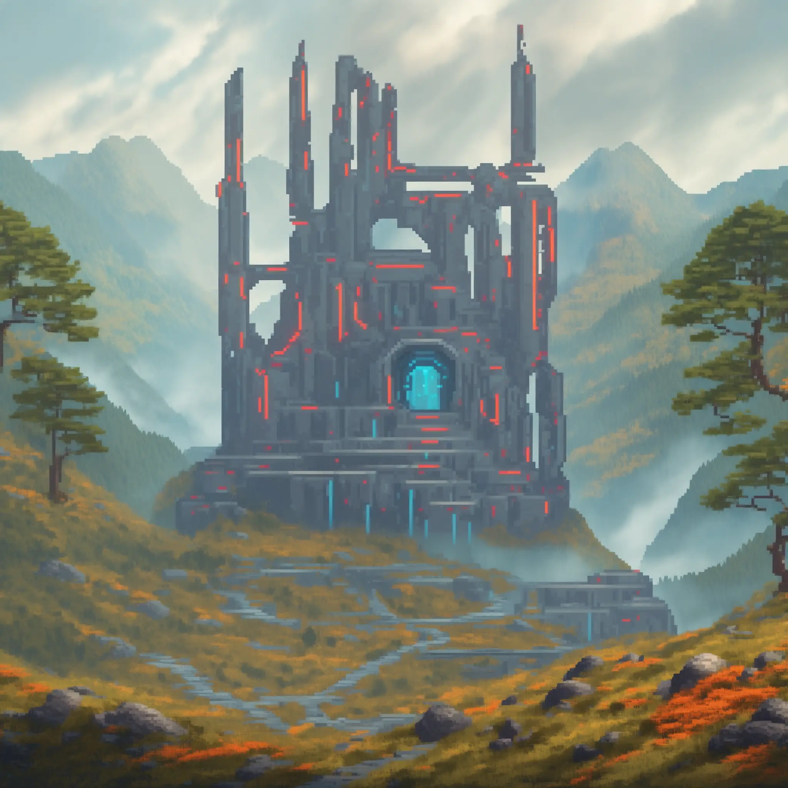
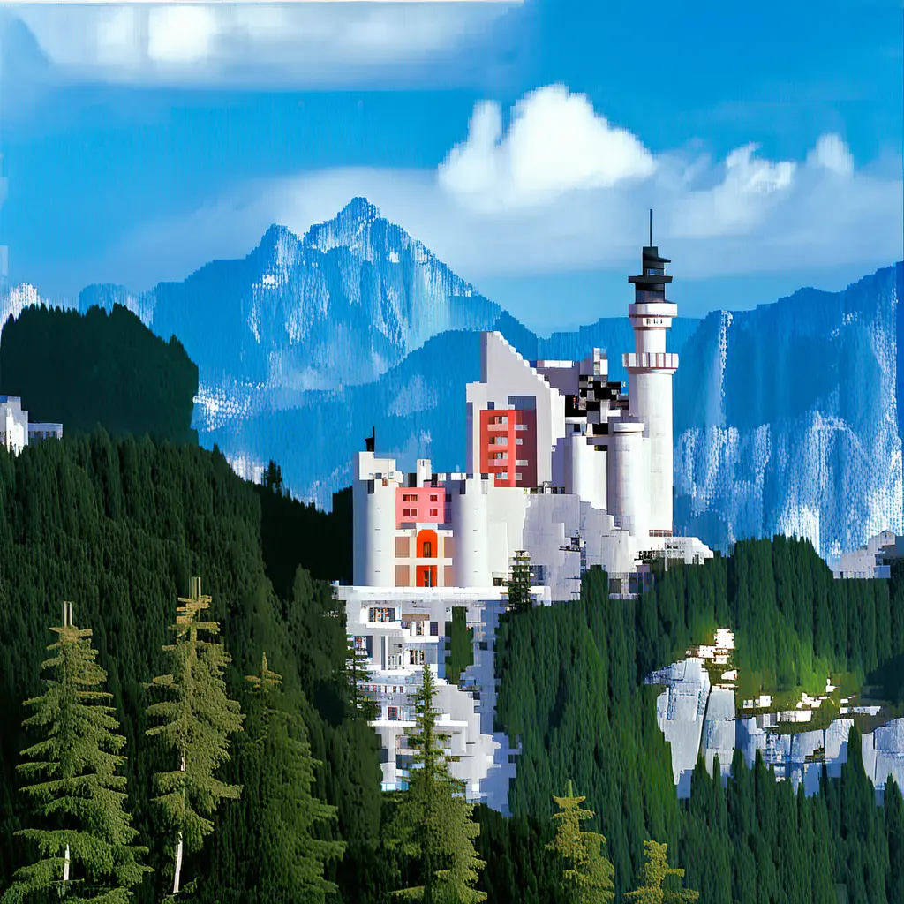

# Adapting Stable Diffusion XL

Stable Diffusion XL (SDXL) is a very popular text-to-image open source foundation model.
This guide will show you how to boost its capabilities with Refiners, using iconic adapters the framework supports out-of-the-box (i.e. without the need for tedious prompt engineering).
We'll follow a step by step approach, progressively increasing the number of adapters involved to showcase how simple adapter composition is using Refiners.
Our use case will be the generation of an image with "a futuristic castle surrounded by a forest, mountains in the background".

## Baseline

Make sure that Refiners is installed in your local environment (see [Getting started](../../getting-started/recommended.md)),
and that you have access to a decent GPU (~24 GB VRAM should be enough).

Before diving into the adapters themselves, let's establish a baseline by simply prompting SDXL with Refiners.

!!! note "Reminder"
    A StableDiffusion model is composed of three modules:

    - An Autoencoder, responsible for embedding images into a latent space
    - A UNet, responsible for the diffusion process
    - A Text Encoder, responsible for encoding the user prompt which will guide the diffusion process.

Start by instantiating a [`StableDiffusion_XL`][refiners.foundationals.latent_diffusion.stable_diffusion_xl.StableDiffusion_XL] model and load the weights.

```py
import torch
from huggingface_hub import hf_hub_download

from refiners.foundationals.latent_diffusion.stable_diffusion_xl import StableDiffusion_XL

# instantiate SDXL model
sdxl = StableDiffusion_XL(
    device="cuda",  # use GPU
    dtype=torch.float16  # use half-precision for memory efficiency
)

# Load the weights
sdxl.clip_text_encoder.load_from_safetensors(
    hf_hub_download(
        repo_id="refiners/sdxl.text_encoder",
        filename="model.safetensors",
    )
)
sdxl.unet.load_from_safetensors(
    hf_hub_download(
        repo_id="refiners/sdxl.unet",
        filename="model.safetensors",
    )
)
sdxl.lda.load_from_safetensors(
    hf_hub_download(
        repo_id="refiners/sdxl.autoencoder_fp16fix",
        filename="model.safetensors",
    )
)
```

Then, define the inference parameters by setting the appropriate prompt, seed and number of inference steps:

```py
# hyperparameters
seed = 42
num_inference_steps = 50
prompt = "a futuristic castle surrounded by a forest, mountains in the background"
sdxl.set_inference_steps(num_inference_steps, first_step=0)

# enable self-attention guidance to enhance the quality of the generated images
sag_scale = 0.75
sdxl.set_self_attention_guidance(enable=True, scale=sag_scale)
```

Finally, define and run the inference process:

```py
from refiners.fluxion.utils import manual_seed, no_grad
from tqdm import tqdm

with no_grad():  # disable gradient calculation for memory-efficient inference
    # encode the text prompts to embeddings, and get the time_ids
    clip_text_embedding, pooled_text_embedding = sdxl.compute_clip_text_embedding(
        text=prompt + ", best quality, high quality",
        negative_text="monochrome, lowres, bad anatomy, worst quality, low quality",
    )
    time_ids = sdxl.default_time_ids

    # seed the random number generator, for reproducibility
    manual_seed(seed)

    # SDXL typically generates 1024x1024, here we use a higher resolution
    x = sdxl.init_latents((2048, 2048))

    # diffusion denoising process
    for step in tqdm(sdxl.steps):
        x = sdxl(
            x,
            step=step,
            clip_text_embedding=clip_text_embedding,
            pooled_text_embedding=pooled_text_embedding,
            time_ids=time_ids,
        )
    predicted_image = sdxl.lda.latents_to_image(x)

predicted_image.save("vanilla_sdxl.png")
```

??? example "Expand to see the entire end-to-end code"

    ```py
    import torch
    from huggingface_hub import hf_hub_download
    from tqdm import tqdm

    from refiners.fluxion.utils import manual_seed, no_grad
    from refiners.foundationals.latent_diffusion.stable_diffusion_xl import StableDiffusion_XL

    # instantiate SDXL model
    sdxl = StableDiffusion_XL(
        device="cuda",  # use GPU
        dtype=torch.float16  # use half-precision for memory efficiency
    )

    # Load the weights
    sdxl.clip_text_encoder.load_from_safetensors(
        hf_hub_download(
            repo_id="refiners/sdxl.text_encoder",
            filename="model.safetensors",
        )
    )
    sdxl.unet.load_from_safetensors(
        hf_hub_download(
            repo_id="refiners/sdxl.unet",
            filename="model.safetensors",
        )
    )
    sdxl.lda.load_from_safetensors(
        hf_hub_download(
            repo_id="refiners/sdxl.autoencoder_fp16fix",
            filename="model.safetensors",
        )
    )

    # hyperparameters
    seed = 42
    num_inference_steps = 50
    prompt = "a futuristic castle surrounded by a forest, mountains in the background"
    sdxl.set_inference_steps(num_inference_steps, first_step=0)

    # enable self-attention guidance to enhance the quality of the generated images
    sag_scale = 0.75
    sdxl.set_self_attention_guidance(enable=True, scale=sag_scale)

    with no_grad():  # disable gradient calculation for memory-efficient inference
        # encode the text prompts to embeddings, and get the time_ids
        clip_text_embedding, pooled_text_embedding = sdxl.compute_clip_text_embedding(
            text=prompt + ", best quality, high quality",
            negative_text="monochrome, lowres, bad anatomy, worst quality, low quality",
        )
        time_ids = sdxl.default_time_ids

        # seed the random number generator, for reproducibility
        manual_seed(seed)

        # SDXL typically generates 1024x1024, here we use a higher resolution
        x = sdxl.init_latents((2048, 2048))

        # diffusion denoising process
        for step in tqdm(sdxl.steps):
            x = sdxl(
                x,
                step=step,
                clip_text_embedding=clip_text_embedding,
                pooled_text_embedding=pooled_text_embedding,
                time_ids=time_ids,
            )
        predicted_image = sdxl.lda.latents_to_image(x)

    predicted_image.save("vanilla_sdxl.png")
    ```

The resulting image should look like this:

<figure markdown>
  
  <figcaption>Generated image of a castle using default SDXL weights.</figcaption>
</figure>

It is not really what we prompted the model for, unfortunately.
To get a more futuristic-looking castle, you can either go for tedious prompt engineering, or use a pretrainered LoRA tailored to our use case,
like the [Sci-fi Environments](https://civitai.com/models/105945?modelVersionId=140624) LoRA available on Civitai.
We'll now show you how the LoRA option works with Refiners.

## Single LoRA

Let's use the [Sci-fi Environments](https://civitai.com/models/105945?modelVersionId=140624) LoRA.
LoRas don't need to be converted, all you have to do is download the safetensors file from the internet.

You can easily download the LoRA by doing:
```bash
curl -L -o scifi.safetensors 'https://civitai.com/api/download/models/140624?type=Model&format=SafeTensor'
```

Inject the LoRA into SDXL using [`SDLoraManager`][refiners.foundationals.latent_diffusion.lora.SDLoraManager] right after instantiating `StableDiffusion_XL`:


```py
from refiners.fluxion.utils import load_from_safetensors
from refiners.foundationals.latent_diffusion.lora import SDLoraManager

# Load LoRA weights from disk and inject them into target
manager = SDLoraManager(sdxl)
scifi_lora_weights = load_from_safetensors("scifi.safetensors")
manager.add_loras("scifi", tensors=scifi_lora_weights)
```

??? example "Expand to see the entire end-to-end code"

    ```py
    import torch
    from huggingface_hub import hf_hub_download
    from tqdm import tqdm

    from refiners.fluxion.utils import load_from_safetensors, manual_seed, no_grad
    from refiners.foundationals.latent_diffusion.lora import SDLoraManager
    from refiners.foundationals.latent_diffusion.stable_diffusion_xl import StableDiffusion_XL

    # instantiate SDXL model
    sdxl = StableDiffusion_XL(
        device="cuda",  # use GPU
        dtype=torch.float16  # use half-precision for memory efficiency
    )

    # Load the weights
    sdxl.clip_text_encoder.load_from_safetensors(
        hf_hub_download(
            repo_id="refiners/sdxl.text_encoder",
            filename="model.safetensors",
        )
    )
    sdxl.unet.load_from_safetensors(
        hf_hub_download(
            repo_id="refiners/sdxl.unet",
            filename="model.safetensors",
        )
    )
    sdxl.lda.load_from_safetensors(
        hf_hub_download(
            repo_id="refiners/sdxl.autoencoder_fp16fix",
            filename="model.safetensors",
        )
    )

    # add Sci-Fi LoRA
    manager = SDLoraManager(sdxl)
    scifi_lora_weights = load_from_safetensors("scifi.safetensors")
    manager.add_loras("scifi", tensors=scifi_lora_weights)

    # hyperparameters
    seed = 42
    num_inference_steps = 50
    prompt = "a futuristic castle surrounded by a forest, mountains in the background"
    sdxl.set_inference_steps(num_inference_steps, first_step=0)

    # enable self-attention guidance to enhance the quality of the generated images
    sag_scale = 0.75
    sdxl.set_self_attention_guidance(enable=True, scale=sag_scale)

    with no_grad():  # disable gradient calculation for memory-efficient inference
        # encode the text prompts to embeddings, and get the time_ids
        clip_text_embedding, pooled_text_embedding = sdxl.compute_clip_text_embedding(
            text=prompt + ", best quality, high quality",
            negative_text="monochrome, lowres, bad anatomy, worst quality, low quality",
        )
        time_ids = sdxl.default_time_ids

        # seed the random number generator, for reproducibility
        manual_seed(seed)

        # SDXL typically generates 1024x1024, here we use a higher resolution
        x = sdxl.init_latents((2048, 2048))

        # diffusion denoising process
        for step in tqdm(sdxl.steps):
            x = sdxl(
                x,
                step=step,
                clip_text_embedding=clip_text_embedding,
                pooled_text_embedding=pooled_text_embedding,
                time_ids=time_ids,
            )

        # decode the latents to an image
        predicted_image = sdxl.lda.decode_latents(x)

    predicted_image.save("scifi_sdxl.png")
    ```

You should get something like this - pretty neat, isn't it?

<figure markdown>
  
  <figcaption>Generated image of a castle in sci-fi style.</figcaption>
</figure>

## Multiple LoRAs

Continuing with our futuristic castle example, we might want to turn it, for instance, into a pixel art.

Again, we could either try some tedious prompt engineering,
or instead use another LoRA found on the web, such as [Pixel Art LoRA](https://civitai.com/models/120096/pixel-art-xl?modelVersionId=135931), found on Civitai.

You can easily download the LoRA by doing:
```bash
curl -L -o pixelart.safetensors 'https://civitai.com/api/download/models/135931?type=Model&format=SafeTensor'
```

Injecting a second LoRA into the current SDXL model is dead simple, as [`SDLoraManager`][refiners.foundationals.latent_diffusion.lora.SDLoraManager] allows loading multiple LoRAs:

```py
# load LoRAs weights from disk and inject them into target
manager = SDLoraManager(sdxl)
manager.add_loras("scifi-lora", load_from_safetensors("scifi.safetensors"))
manager.add_loras("pixel-art-lora", load_from_safetensors("pixelart.safetensors"))
```

Adapters such as LoRAs also have a [scale][refiners.fluxion.adapters.Lora.scale] (roughly) quantifying the effect of this Adapter.
Refiners allows setting different scales for each Adapter, allowing the user to balance the effect of each Adapter:

```py
# load LoRAs weights from disk and inject them into target
manager = SDLoraManager(sdxl)
manager.add_loras("scifi-lora", load_from_safetensors("scifi.safetensors"), scale=1.0)
manager.add_loras("pixel-art-lora", load_from_safetensors("pixelart.safetensors"), scale=1.4)
```

??? example "Expand to see the entire end-to-end code"

    ```py
    import torch
    from huggingface_hub import hf_hub_download
    from tqdm import tqdm

    from refiners.fluxion.utils import load_from_safetensors, manual_seed, no_grad
    from refiners.foundationals.latent_diffusion.lora import SDLoraManager
    from refiners.foundationals.latent_diffusion.stable_diffusion_xl import StableDiffusion_XL

    # instantiate SDXL model
    sdxl = StableDiffusion_XL(
        device="cuda",  # use GPU
        dtype=torch.float16  # use half-precision for memory efficiency
    )

    # Load the weights
    sdxl.clip_text_encoder.load_from_safetensors(
        hf_hub_download(
            repo_id="refiners/sdxl.text_encoder",
            filename="model.safetensors",
        )
    )
    sdxl.unet.load_from_safetensors(
        hf_hub_download(
            repo_id="refiners/sdxl.unet",
            filename="model.safetensors",
        )
    )
    sdxl.lda.load_from_safetensors(
        hf_hub_download(
            repo_id="refiners/sdxl.autoencoder_fp16fix",
            filename="model.safetensors",
        )
    )

    # add Sci-Fi and Pixel-Art LoRAs
    manager = SDLoraManager(sdxl)
    manager.add_loras("scifi-lora", load_from_safetensors("scifi.safetensors"), scale=1.0)
    manager.add_loras("pixel-art-lora", load_from_safetensors("pixelart.safetensors"), scale=1.4)

    # hyperparameters
    seed = 42
    num_inference_steps = 50
    prompt = "a futuristic castle surrounded by a forest, mountains in the background"
    sdxl.set_inference_steps(num_inference_steps, first_step=0)

    # enable self-attention guidance to enhance the quality of the generated images
    sag_scale = 0.75
    sdxl.set_self_attention_guidance(enable=True, scale=sag_scale)

    with no_grad():  # disable gradient calculation for memory-efficient inference
        # encode the text prompts to embeddings, and get the time_ids
        clip_text_embedding, pooled_text_embedding = sdxl.compute_clip_text_embedding(
            text=prompt + ", best quality, high quality",
            negative_text="monochrome, lowres, bad anatomy, worst quality, low quality",
        )
        time_ids = sdxl.default_time_ids

        # seed the random number generator, for reproducibility
        manual_seed(seed)

        # SDXL typically generates 1024x1024, here we use a higher resolution
        x = sdxl.init_latents((2048, 2048))

        # diffusion denoising process
        for step in tqdm(sdxl.steps):
            x = sdxl(
                x,
                step=step,
                clip_text_embedding=clip_text_embedding,
                pooled_text_embedding=pooled_text_embedding,
                time_ids=time_ids,
            )
        predicted_image = sdxl.lda.latents_to_image(x)

    predicted_image.save("scifi_pixel_sdxl.png")
    ```

The results are looking great:

<figure markdown>
  
  <figcaption>Generated image of a castle in sci-fi, pixel art style.</figcaption>
</figure>

## Multiple LoRAs + IP-Adapter

Refiners really shines when it comes to composing different Adapters to fully exploit the possibilities of foundation models.

For instance, IP-Adapter (covered in [a previous blog post](https://blog.finegrain.ai/posts/supercharge-stable-diffusion-ip-adapter/)) is a common choice for practictioners wanting to guide the diffusion process towards a specific prompt image.

In our example, we would like to guide the diffusion process to align with this image of the [Neuschwanstein Castle](https://en.wikipedia.org/wiki/Neuschwanstein_Castle):

<figure markdown>
  
  <figcaption>Credits: Bayerische Schlösserverwaltung, Anton Brandl</figcaption>
</figure>

You can easily download the above image by doing:

```bash
curl -O https://finegrain-ai.github.io/refiners/guides/adapting_sdxl/german-castle.jpg
```

Instantiate a [`SDXLIPAdapter`][refiners.foundationals.latent_diffusion.stable_diffusion_xl.image_prompt.SDXLIPAdapter] targeting our `sdxl.unet`, and inject it using a simple `.inject()` call:

```py
from refiners.foundationals.latent_diffusion.stable_diffusion_xl.image_prompt import SDXLIPAdapter

# load IP-Adapter
ip_adapter = SDXLIPAdapter(
    target=sdxl.unet,
    weights=load_from_safetensors(
        hf_hub_download(
            repo_id="refiners/sdxl.ip_adapter.plus",
            filename="model.safetensors",
        ),
    ),
    scale=1.0,
    fine_grained=True,  # Use fine-grained IP-Adapter (i.e IP-Adapter Plus)
)
ip_adapter.clip_image_encoder.load_from_safetensors(
    hf_hub_download(
        repo_id="refiners/sd21.unclip.image_encoder",
        filename="model.safetensors",
    )
)
ip_adapter.inject()
```

Then, at runtime, we simply compute the embedding of the image prompt through the `ip_adapter` object, and set its embedding calling `.set_clip_image_embedding()`:

```py
from PIL import Image
image_prompt = Image.open("german-castle.jpg")

with torch.no_grad():
    clip_image_embedding = ip_adapter.compute_clip_image_embedding(ip_adapter.preprocess_image(image_prompt))
    ip_adapter.set_clip_image_embedding(clip_image_embedding)

# And start the diffusion process
```

!!! note
    Be wary that composing Adapters (especially ones of different natures, such as LoRAs and IP-Adapter) can be tricky, as their respective effects can be adversarial.
    This is visible in our example below. In the code below, we tuned the LoRAs scales respectively to `1.5` and `1.55`.
    We invite you to try and test different seeds and scales to find the perfect combination!
    Furthermore, the order in which you inject adapters can also have an impact on the final result.

??? example "Expand to see the entire end-to-end code"

    ```py
    import torch
    from huggingface_hub import hf_hub_download
    from PIL import Image
    from tqdm import tqdm

    from refiners.fluxion.utils import load_from_safetensors, manual_seed, no_grad
    from refiners.foundationals.latent_diffusion.lora import SDLoraManager
    from refiners.foundationals.latent_diffusion.stable_diffusion_xl import StableDiffusion_XL
    from refiners.foundationals.latent_diffusion.stable_diffusion_xl.image_prompt import SDXLIPAdapter

    # instantiate SDXL model
    sdxl = StableDiffusion_XL(
        device="cuda",  # use GPU
        dtype=torch.float16  # use half-precision for memory efficiency
    )

    # Load the weights
    sdxl.clip_text_encoder.load_from_safetensors(
        hf_hub_download(
            repo_id="refiners/sdxl.text_encoder",
            filename="model.safetensors",
        )
    )
    sdxl.unet.load_from_safetensors(
        hf_hub_download(
            repo_id="refiners/sdxl.unet",
            filename="model.safetensors",
        )
    )
    sdxl.lda.load_from_safetensors(
        hf_hub_download(
            repo_id="refiners/sdxl.autoencoder_fp16fix",
            filename="model.safetensors",
        )
    )

    # hyperparameters
    seed = 42
    num_inference_steps = 50
    prompt = "a futuristic castle surrounded by a forest, mountains in the background"
    sdxl.set_inference_steps(num_inference_steps, first_step=0)

    # enable self-attention guidance to enhance the quality of the generated images
    sag_scale = 0.75
    sdxl.set_self_attention_guidance(enable=True, scale=sag_scale)

    # add Sci-Fi and Pixel-Art LoRAs
    manager = SDLoraManager(sdxl)
    manager.add_loras("scifi-lora", load_from_safetensors("scifi.safetensors"), scale=1.5)
    manager.add_loras("pixel-art-lora", load_from_safetensors("pixelart.safetensors"), scale=1.55)

    # Instantiate the IP-Adapter
    ip_adapter = SDXLIPAdapter(
        target=sdxl.unet,
        weights=load_from_safetensors(
            hf_hub_download(
                repo_id="refiners/sdxl.ip_adapter.plus",
                filename="model.safetensors",
            ),
        ),
        scale=1.0,
        fine_grained=True,  # Use fine-grained IP-Adapter (i.e IP-Adapter Plus)
    )
    ip_adapter.clip_image_encoder.load_from_safetensors(
        hf_hub_download(
            repo_id="refiners/sd21.unclip.image_encoder",
            filename="model.safetensors",
        )
    )
    ip_adapter.inject()

    # load image prompt
    image_prompt = Image.open("german-castle.jpg")

    with no_grad():  # disable gradient calculation for memory-efficient inference
        # encode the text prompts to embeddings, and get the time_ids
        clip_text_embedding, pooled_text_embedding = sdxl.compute_clip_text_embedding(
            text=prompt + ", best quality, high quality",
            negative_text="monochrome, lowres, bad anatomy, worst quality, low quality",
        )
        time_ids = sdxl.default_time_ids

        # compute image prompt embeddings
        clip_image_embedding = ip_adapter.compute_clip_image_embedding(ip_adapter.preprocess_image(image_prompt))
        ip_adapter.set_clip_image_embedding(clip_image_embedding)

        # seed the random number generator, for reproducibility
        manual_seed(seed)

        # SDXL typically generates 1024x1024
        x = sdxl.init_latents((1024, 1024))

        # diffusion denoising process
        for step in tqdm(sdxl.steps):
            x = sdxl(
                x,
                step=step,
                clip_text_embedding=clip_text_embedding,
                pooled_text_embedding=pooled_text_embedding,
                time_ids=time_ids,
            )
        predicted_image = sdxl.lda.latents_to_image(x)

    predicted_image.save("scifi_pixel_IP_sdxl.png")
    ```

The result looks convincing: we do get a *pixel-art, futuristic-looking Neuschwanstein castle*!

<figure markdown>
  
  <figcaption>Generated image in sci-fi, pixel art style, using IP-Adapter.</figcaption>
</figure>


## Multiple LoRAs + IP-Adapter + T2I-Adapter

T2I-Adapters are a powerful class of Adapters aiming at controlling the Text-to-Image (T2I) diffusion process with external control signals, such as canny edges or pose estimations inputs.
In this section, we will compose our previous example with the [Depth-Zoe Adapter](https://huggingface.co/TencentARC/t2i-adapter-depth-zoe-sdxl-1.0), providing a depth condition to the diffusion process using the following depth map as input signal:

<figure markdown>
  
  <figcaption>Input depth map of the initial castle image.</figcaption>
</figure>

You can easily download the above image by doing:

```bash
curl -O https://finegrain-ai.github.io/refiners/guides/adapting_sdxl/zoe-depth-map-german-castle.png
```

Then, just inject it as usual:

```py
from refiners.foundationals.latent_diffusion.stable_diffusion_xl.t2i_adapter import SDXLT2IAdapter

# Load T2I-Adapter
t2i_adapter = SDXLT2IAdapter(
    target=sdxl.unet,
    name="zoe-depth",
    weights=load_from_safetensors(
        hf_hub_download(
            repo_id="refiners/sdxl.t2i_adapter.depth.zoe",
            filename="model.safetensors",
        ),
    ),
    scale=0.72,
).inject()
```

Finally, at runtime, compute the embedding of the input condition through the `t2i_adapter` object, and set its embedding calling `.set_condition_features()`:

```py
from refiners.fluxion.utils import image_to_tensor, interpolate

image_depth_condition = Image.open("zoe-depth-map-german-castle.png")

with torch.no_grad():
    condition = image_to_tensor(image_depth_condition.convert("RGB"), device=sdxl.device, dtype=sdxl.dtype)
    # Spatial dimensions should be divisible by default downscale factor (=16 for T2IAdapter ConditionEncoder)
    condition = interpolate(condition, torch.Size((1024, 1024)))
    t2i_adapter.set_condition_features(features=t2i_adapter.compute_condition_features(condition))

```

??? example "Expand to see the entire end-to-end code"

    ```py
    import torch
    from huggingface_hub import hf_hub_download
    from PIL import Image
    from tqdm import tqdm

    from refiners.fluxion.utils import image_to_tensor, interpolate, load_from_safetensors, manual_seed, no_grad
    from refiners.foundationals.latent_diffusion.lora import SDLoraManager
    from refiners.foundationals.latent_diffusion.stable_diffusion_xl import StableDiffusion_XL
    from refiners.foundationals.latent_diffusion.stable_diffusion_xl.image_prompt import SDXLIPAdapter
    from refiners.foundationals.latent_diffusion.stable_diffusion_xl.t2i_adapter import SDXLT2IAdapter

    # instantiate SDXL model
    sdxl = StableDiffusion_XL(
        device="cuda",  # use GPU
        dtype=torch.float16  # use half-precision for memory efficiency
    )

    # Load the weights
    sdxl.clip_text_encoder.load_from_safetensors(
        hf_hub_download(
            repo_id="refiners/sdxl.text_encoder",
            filename="model.safetensors",
        )
    )
    sdxl.unet.load_from_safetensors(
        hf_hub_download(
            repo_id="refiners/sdxl.unet",
            filename="model.safetensors",
        )
    )
    sdxl.lda.load_from_safetensors(
        hf_hub_download(
            repo_id="refiners/sdxl.autoencoder_fp16fix",
            filename="model.safetensors",
        )
    )

    # hyperparameters
    seed = 42
    num_inference_steps = 50
    prompt = "a futuristic castle surrounded by a forest, mountains in the background"
    sdxl.set_inference_steps(num_inference_steps, first_step=0)

    # enable self-attention guidance to enhance the quality of the generated images
    sag_scale = 0.75
    sdxl.set_self_attention_guidance(enable=True, scale=sag_scale)

    # add Sci-Fi and Pixel-Art LoRAs
    manager = SDLoraManager(sdxl)
    manager.add_loras("scifi-lora", load_from_safetensors("scifi.safetensors"), scale=1.5)
    manager.add_loras("pixel-art-lora", load_from_safetensors("pixelart.safetensors"), scale=1.55)

    # Instantiate the IP-Adapter
    ip_adapter = SDXLIPAdapter(
        target=sdxl.unet,
        weights=load_from_safetensors(
            hf_hub_download(
                repo_id="refiners/sdxl.ip_adapter.plus",
                filename="model.safetensors",
            ),
        ),
        scale=1.0,
        fine_grained=True,  # Use fine-grained IP-Adapter (i.e IP-Adapter Plus)
    )
    ip_adapter.clip_image_encoder.load_from_safetensors(
        hf_hub_download(
            repo_id="refiners/sd21.unclip.image_encoder",
            filename="model.safetensors",
        )
    )
    ip_adapter.inject()

    # Load T2I-Adapter
    t2i_adapter = SDXLT2IAdapter(
        target=sdxl.unet,
        name="zoe-depth",
        weights=load_from_safetensors(
            hf_hub_download(
                repo_id="refiners/sdxl.t2i_adapter.depth.zoe",
                filename="model.safetensors",
            ),
        ),
        scale=0.72,
    ).inject()

    # load image prompt and image depth condition
    image_prompt = Image.open("german-castle.jpg")
    image_depth_condition = Image.open("zoe-depth-map-german-castle.png")

    with no_grad():  # disable gradient calculation for memory-efficient inference
        # encode the text prompts to embeddings, and get the time_ids
        clip_text_embedding, pooled_text_embedding = sdxl.compute_clip_text_embedding(
            text=prompt + ", best quality, high quality",
            negative_text="monochrome, lowres, bad anatomy, worst quality, low quality",
        )
        time_ids = sdxl.default_time_ids

        # compute and set image prompt embeddings
        clip_image_embedding = ip_adapter.compute_clip_image_embedding(ip_adapter.preprocess_image(image_prompt))
        ip_adapter.set_clip_image_embedding(clip_image_embedding)

        # compute and set the T2I features
        condition = image_to_tensor(image_depth_condition.convert("RGB"), device=sdxl.device, dtype=sdxl.dtype)
        condition = interpolate(condition, torch.Size((1024, 1024)))
        t2i_features = t2i_adapter.compute_condition_features(condition)
        t2i_adapter.set_condition_features(features=t2i_features)

        # seed the random number generator, for reproducibility
        manual_seed(seed)

        # SDXL typically generates 1024x1024
        x = sdxl.init_latents((1024, 1024))

        # diffusion denoising process
        for step in tqdm(sdxl.steps):
            x = sdxl(
                x,
                step=step,
                clip_text_embedding=clip_text_embedding,
                pooled_text_embedding=pooled_text_embedding,
                time_ids=time_ids,
            )
        predicted_image = sdxl.lda.latents_to_image(x)

    predicted_image.save("scifi_pixel_IP_T2I_sdxl.png")
    ```

The results look convincing: the depth and proportions of the initial castle are more faithful, while preserving our *futuristic, pixel-art style*!
<figure markdown>
  
  <figcaption>Generated image in sci-fi, pixel art style, using IP and T2I Adapters.</figcaption>
</figure>

## Wrap up

As you can see in this guide, composing Adapters on top of foundation models is pretty seamless in Refiners, allowing practitioners to quickly test out different combinations of Adapters for their needs. We encourage you to try out different ones, and even train some yourselves!
