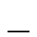
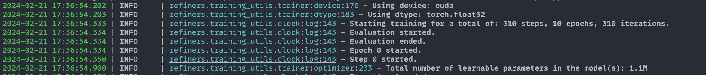
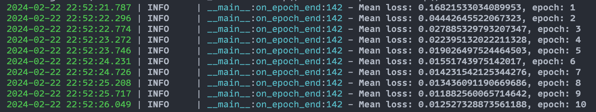

# Training 101

This guide will walk you through training a model using Refiners. We built the `training_utils` module to provide a simple, flexible, statically type-safe interface.

We will use a simple model and a toy dataset for demonstration purposes. The model will be a simple [autoencoder](https://en.wikipedia.org/wiki/Autoencoder), and the dataset will be a synthetic dataset of rectangles
of different sizes.

## Pre-requisites

We recommend installing Refiners targeting a specific commit hash to avoid unexpected changes in the API. You also 
get the benefit of having a perfectly reproducible environment.

- with rye (recommended):
```bash
rye add refiners[training] --git=https://github.com/finegrain-ai/refiners.git --branch=<insert-latest-commit-hash>
```

- with pip:
```bash
 pip install "git+https://github.com/finegrain-ai/refiners.git@<insert-latest-commit-hash>#egg=refiners[training]"
```

## Model

Let's start by building our autoencoder using Refiners.

??? autoencoder "Expand to see the autoencoder model."

    ```py
    from refiners.fluxion import layers as fl


     class ConvBlock(fl.Chain):
        def __init__(self, in_channels: int, out_channels: int) -> None:
            super().__init__(
                fl.Conv2d(
                    in_channels=in_channels,
                    out_channels=out_channels,
                    kernel_size=3,
                    padding=1,
                    groups=min(in_channels, out_channels)
                ),
                fl.LayerNorm2d(out_channels),
                fl.SiLU(),
                fl.Conv2d(
                    in_channels=out_channels,
                    out_channels=out_channels,
                    kernel_size=1,
                    padding=0,
                ),
                fl.LayerNorm2d(out_channels),
                fl.SiLU(),
            )


    class ResidualBlock(fl.Sum):
        def __init__(self, in_channels: int, out_channels: int) -> None:
            super().__init__(
                ConvBlock(in_channels=in_channels, out_channels=out_channels),
                fl.Conv2d(
                    in_channels=in_channels,
                    out_channels=out_channels,
                    kernel_size=3,
                    padding=1,
                ),
            )


    class Encoder(fl.Chain):
        def __init__(self) -> None:
            super().__init__(
                ResidualBlock(in_channels=1, out_channels=8),
                fl.Downsample(channels=8, scale_factor=2, register_shape=False),
                ResidualBlock(in_channels=8, out_channels=16),
                fl.Downsample(channels=16, scale_factor=2, register_shape=False),
                ResidualBlock(in_channels=16, out_channels=32),
                fl.Downsample(channels=32, scale_factor=2, register_shape=False),
                fl.Reshape(2048),
                fl.Linear(in_features=2048, out_features=256),
                fl.SiLU(),
                fl.Linear(in_features=256, out_features=256),
            )


    class Decoder(fl.Chain):
        def __init__(self) -> None:
            super().__init__(
                fl.Linear(in_features=256, out_features=256),
                fl.SiLU(),
                fl.Linear(in_features=256, out_features=2048),
                fl.Reshape(32, 8, 8),
                ResidualBlock(in_channels=32, out_channels=32),
                ResidualBlock(in_channels=32, out_channels=32),
                fl.Upsample(channels=32, upsample_factor=2),
                ResidualBlock(in_channels=32, out_channels=16),
                ResidualBlock(in_channels=16, out_channels=16),
                fl.Upsample(channels=16, upsample_factor=2),
                ResidualBlock(in_channels=16, out_channels=8),
                ResidualBlock(in_channels=8, out_channels=8),
                fl.Upsample(channels=8, upsample_factor=2),
                ResidualBlock(in_channels=8, out_channels=8),
                ResidualBlock(in_channels=8, out_channels=1),
                fl.Sigmoid(),
            )


    class Autoencoder(fl.Chain):
        def __init__(self) -> None:
            super().__init__(
                Encoder(),
                Decoder(),
            )

        @property
        def encoder(self) -> Encoder:
            return self.ensure_find(Encoder)

        @property
        def decoder(self) -> Decoder:
            return self.ensure_find(Decoder)

    ```

We now have a fully functional autoencoder that takes an image with one channel of
size 64x64 and compresses it to a vector of size 256 (x16 compression). The decoder then takes this vector and reconstructs the original image.

```py
import torch

autoencoder = Autoencoder()

x = torch.randn(2, 1, 64, 64) # batch of 2 images

z = autoencoder.encoder(x) # [2, 256]

x_reconstructed = autoencoder.decoder(z) # [2, 1, 64, 64]
```

## Dataset

We will use a synthetic dataset of rectangles of different sizes. The dataset will be generated on the fly using this 
simple function:

```python
import random
from typing import Generator
from PIL import Image

from refiners.fluxion.utils import image_to_tensor

def generate_mask(size: int, seed: int | None = None) -> Generator[torch.Tensor, None, None]:
    """Generate a tensor of a binary mask of size `size` using random rectangles."""
    if seed is None:
        seed = random.randint(0, 2**32 - 1)
    random.seed(seed)

    while True:
        rectangle = Image.new(
            "L", (random.randint(1, size), random.randint(1, size)), color=255
        )
        mask = Image.new("L", (size, size))
        mask.paste(
            rectangle,
            (
                random.randint(0, size - rectangle.width),
                random.randint(0, size - rectangle.height),
            ),
        )
        tensor = image_to_tensor(mask)

        if random.random() > 0.5:
            tensor = 1 - tensor

        yield tensor
```

To generate a mask, do:

```python
from refiners.fluxion.utils import tensor_to_image

mask = next(generate_mask(64, seed=42))
tensor_to_image(mask).save("mask.png")
```

Here are a two examples of generated masks:



## Trainer

We will now create a Trainer class to handle the training loop. This class will manage the model, the optimizer, the loss function, and the dataset. It will also orchestrate the training loop and the evaluation loop.

But first, we need to define the batch type that will be used to represent a batch for the forward and backward pass and the configuration associated with the trainer.

### Batch

Our batches are composed of a single tensor representing the images. We will define a simple `Batch` type to implement this.

```python
from dataclasses import dataclass

@dataclass
class Batch:
    image: torch.Tensor
```

### Config

We will now define the configuration for the autoencoder. It holds the configuration for the training loop, the optimizer, and the learning rate scheduler. It should inherit `refiners.training_utils.BaseConfig` and has the following mandatory attributes:

  - `TrainingConfig`: The configuration for the training loop, including the duration of the training, the batch size, device, dtype, etc.
  - `OptimizerConfig`: The configuration for the optimizer, including the learning rate, weight decay, etc.
  - `LRSchedulerConfig`: The configuration for the learning rate scheduler, including the scheduler type, parameters, etc.

Example:

```python
from refiners.training_utils import BaseConfig, TrainingConfig, OptimizerConfig, LRSchedulerConfig, Optimizers, LRSchedulerType, Epoch

class AutoencoderConfig(BaseConfig):
    ...

training = TrainingConfig(
    duration=Epoch(1000),
    device="cuda" if torch.cuda.is_available() else "cpu",
    dtype="float32"
)

optimizer = OptimizerConfig(
    optimizer=Optimizers.AdamW,
    learning_rate=1e-4,
)

lr_scheduler = LRSchedulerConfig(
    type=LRSchedulerType.ConstantLR
)

config = AutoencoderConfig(
    training=training,
    optimizer=optimizer,
    lr_scheduler=lr_scheduler,
)
```

### Subclass

We can now define the Trainer subclass. It should inherit from `refiners.training_utils.Trainer` and implement the following methods:

  - `create_data_iterable`: The `Trainer` will call this method to create and cache the data iterable. During training, the loop will pull batches from this iterable and pass them to the `compute_loss` method. Every time the iterable is exhausted, an epoch ends.
  - `compute_loss`: This method should take a Batch and return the loss tensor.

Here is a simple implementation of the `create_data_iterable` method. For this toy example, we will generate a simple list of `Batch` objects containing random masks. Later you can replace this with `torch.utils.data.DataLoader` or any other data loader with more complex features that support shuffling, parallel loading, etc.

```python
from functools import cached_property
from refiners.training_utils import Trainer


class AutoencoderConfig(BaseConfig):
    num_images: int = 2048
    batch_size: int = 32


class AutoencoderTrainer(Trainer[AutoencoderConfig, Batch]):
    def create_data_iterable(self) -> list[Batch]:
        dataset: list[Batch] = []
        generator = generate_mask(size=64)

        for _ in range(self.config.num_images // self.config.batch_size):
            masks = [next(generator) for _ in range(self.config.batch_size)]
            dataset.append(Batch(image=torch.cat(masks, dim=0)))
        
        return dataset

    def compute_loss(self, batch: Batch) -> torch.Tensor:
        raise NotImplementedError("We'll implement this later")


trainer = AutoencoderTrainer(config)
```

### Model registration

For the Trainer to be able to handle the model, we need to register it. 

We need two things to do so: 

 - Add `refiners.training_utils.ModelConfig` attribute to the Config named `autoencoder`.
 - Add a method to the Trainer subclass that returns the model decorated with `@register_model` decorator. This method should take the `ModelConfig` as an argument. The Trainer's `__init__` will register the models and add any parameters to the optimizer that have `requires_grad` enabled.

After registering the model, the `self.autoencoder` attribute will be available in the Trainer.

```python
from refiners.training_utils import ModelConfig, register_model


class AutoencoderModelConfig(ModelConfig):
    pass


class AutoencoderConfig(BaseConfig):
    num_images: int = 2048
    batch_size: int = 32
    autoencoder: AutoencoderModelConfig


class AutoencoderTrainer(Trainer[AutoencoderConfig, Batch]):
    # ... other methods

    @register_model()
    def autoencoder(self, config: AutoencoderModelConfig) -> Autoencoder:
        return Autoencoder()

    def compute_loss(self, batch: Batch) -> torch.Tensor:
        batch.image = batch.image.to(self.device, self.dtype)
        x_reconstructed = self.autoencoder.decoder(
            self.autoencoder.encoder(batch.image)
        )
        return F.binary_cross_entropy(x_reconstructed, batch.image)
```

We now have a fully functional Trainer that can train our autoencoder. We can now call the `train` method to start the training loop.

```python
trainer.train()
```




## Logging

Let's write a simple logging callback to log the loss and the reconstructed images during training. A callback is a class that inherits from `refiners.training_utils.Callback` and implement any of the following methods:

- `on_init_begin`
- `on_init_end`
- `on_train_begin`
- `on_train_end`
- `on_epoch_begin`
- `on_epoch_end`
- `on_step_begin`
- `on_step_end`
- `on_backward_begin`
- `on_backward_end`
- `on_optimizer_step_begin`
- `on_optimizer_step_end`
- `on_compute_loss_begin`
- `on_compute_loss_end`
- `on_evaluate_begin`
- `on_evaluate_end`
- `on_lr_scheduler_step_begin`
- `on_lr_scheduler_step_end`

We will implement the `on_epoch_end` method to log the loss and the reconstructed images and the `on_compute_loss_end` method to store the loss in a list.

```python
from refiners.training_utils import Callback
from loguru import logger
from typing import Any


class LoggingCallback(Callback[Any]):
    losses: list[float] = []

    def on_compute_loss_end(self, loss: torch.Tensor) -> None:
        self.losses.append(loss.item())

    def on_epoch_end(self, epoch: int) -> None:
        mean_loss = sum(self.losses) / len(self.losses)
        logger.info(f"Mean loss: {mean_loss}, epoch: {epoch}")
        self.losses = []
```

Exactly like models, we need to register the callback to the Trainer. We can do so by adding a CallbackConfig attribute to the Config named `logging` and adding a method to the Trainer class that returns the callback decorated with `@register_callback` decorator. 

```python
from refiners.training_utils import CallbackConfig, register_callback

class AutoencoderConfig(BaseConfig):
    # ... other properties
    logging: CallbackConfig = CallbackConfig()


class AutoencoderTrainer(Trainer[AutoencoderConfig, Batch]):
    # ... other methods

    @register_callback()
    def logging(self, config: CallbackConfig) -> LoggingCallback:
        return LoggingCallback()
```



## Evaluation

Let's add an evaluation step to the Trainer. We will generate a few masks and their reconstructions and save them to a file. We start by implementing a `compute_evaluation` method, then we register a callback to call this method at regular intervals.


```python
class AutoencoderTrainer(Trainer[AutoencoderConfig, Batch]):
    # ... other methods

    def compute_evaluation(self) -> None:
        generator = generate_mask(size=64, seed=0)

        grid: list[tuple[Image.Image, Image.Image]] = []
        for _ in range(4):
            mask = next(generator).to(self.device, self.dtype)
            x_reconstructed = self.autoencoder.decoder(
                self.autoencoder.encoder(mask)
            )
            loss = F.mse_loss(x_reconstructed, mask)
            logger.info(f"Validation loss: {loss.detach().cpu().item()}")
            grid.append(
                (tensor_to_image(mask), tensor_to_image((x_reconstructed>0.5).float()))
            )

        import matplotlib.pyplot as plt

        _, axes = plt.subplots(4, 2, figsize=(8, 16))

        for i, (mask, reconstructed) in enumerate(grid):
            axes[i, 0].imshow(mask, cmap='gray')
            axes[i, 0].axis('off')
            axes[i, 0].set_title('Mask')

            axes[i, 1].imshow(reconstructed, cmap='gray')
            axes[i, 1].axis('off')
            axes[i, 1].set_title('Reconstructed')

        plt.tight_layout()
        plt.savefig(f"result_{trainer.clock.epoch}.png")
        plt.close()
```

We starting by implementing an `EvaluationConfig` that controls the evaluation interval and the seed for the random generator.

```python
from refiners.training_utils.config import TimeValueField

class EvaluationConfig(CallbackConfig):
    interval: TimeValueField
    seed: int
```

The `TimeValueField` is a custom field that allow Pydantic to parse a string representing a time value (e.g., "50:epochs") into a `TimeValue` object. This is useful to specify the evaluation interval in the configuration file.

```python
from refiners.training_utils import scoped_seed, Callback

class EvaluationCallback(Callback[Any]):
    def __init__(self, config: EvaluationConfig) -> None:
        self.config = config

    def on_epoch_end(self, trainer: Trainer) -> None:
        # The `is_due` method checks if the current epoch is a multiple of the interval.
        if not trainer.clock.is_due(self.config.interval):
            return

        # The `scoped_seed` context manager encapsulates the random state for the evaluation and restores it after the 
        # evaluation.
        with scoped_seed(self.config.seed):
            trainer.compute_evaluation()
```

We can now register the callback to the Trainer.
        

```python
class AutoencoderConfig(BaseConfig):
    # ... other properties
    evaluation: EvaluationConfig
```


```python
class AutoencoderTrainer(Trainer[AutoencoderConfig, Batch]):
    # ... other methods

    @register_callback()
    def evaluation(self, config: EvaluationConfig) -> EvaluationCallback:
        return EvaluationCallback(config)   
```

We can now train the model and see the results in the `result_{epoch}.png` files.


## Wrap up

You can train this toy model using the code below:

??? complete end-to-end code "Expand to see the full code."

    ```py
    import random
    from dataclasses import dataclass
    from typing import Any, Generator

    import torch
    from loguru import logger
    from PIL import Image
    from torch.nn import functional as F

    from refiners.fluxion import layers as fl
    from refiners.fluxion.utils import image_to_tensor, tensor_to_image
    from refiners.training_utils import (
        BaseConfig,
        Callback,
        CallbackConfig,
        ClockConfig,
        Epoch,
        LRSchedulerConfig,
        LRSchedulerType,
        ModelConfig,
        OptimizerConfig,
        Optimizers,
        Trainer,
        TrainingConfig,
        register_callback,
        register_model,
    )
    from refiners.training_utils.common import scoped_seed
    from refiners.training_utils.config import TimeValueField


    class ConvBlock(fl.Chain):
        def __init__(self, in_channels: int, out_channels: int) -> None:
            super().__init__(
                fl.Conv2d(
                    in_channels=in_channels,
                    out_channels=out_channels,
                    kernel_size=3,
                    padding=1,
                    groups=min(in_channels, out_channels),
                ),
                fl.LayerNorm2d(out_channels),
                fl.SiLU(),
                fl.Conv2d(
                    in_channels=out_channels,
                    out_channels=out_channels,
                    kernel_size=1,
                    padding=0,
                ),
                fl.LayerNorm2d(out_channels),
                fl.SiLU(),
            )


    class ResidualBlock(fl.Sum):
        def __init__(self, in_channels: int, out_channels: int) -> None:
            super().__init__(
                ConvBlock(in_channels=in_channels, out_channels=out_channels),
                fl.Conv2d(
                    in_channels=in_channels,
                    out_channels=out_channels,
                    kernel_size=3,
                    padding=1,
                ),
            )


    class Encoder(fl.Chain):
        def __init__(self) -> None:
            super().__init__(
                ResidualBlock(in_channels=1, out_channels=8),
                fl.Downsample(channels=8, scale_factor=2, register_shape=False),
                ResidualBlock(in_channels=8, out_channels=16),
                fl.Downsample(channels=16, scale_factor=2, register_shape=False),
                ResidualBlock(in_channels=16, out_channels=32),
                fl.Downsample(channels=32, scale_factor=2, register_shape=False),
                fl.Reshape(2048),
                fl.Linear(in_features=2048, out_features=256),
                fl.SiLU(),
                fl.Linear(in_features=256, out_features=256),
            )


    class Decoder(fl.Chain):
        def __init__(self) -> None:
            super().__init__(
                fl.Linear(in_features=256, out_features=256),
                fl.SiLU(),
                fl.Linear(in_features=256, out_features=2048),
                fl.Reshape(32, 8, 8),
                ResidualBlock(in_channels=32, out_channels=32),
                ResidualBlock(in_channels=32, out_channels=32),
                fl.Upsample(channels=32, upsample_factor=2),
                ResidualBlock(in_channels=32, out_channels=16),
                ResidualBlock(in_channels=16, out_channels=16),
                fl.Upsample(channels=16, upsample_factor=2),
                ResidualBlock(in_channels=16, out_channels=8),
                ResidualBlock(in_channels=8, out_channels=8),
                fl.Upsample(channels=8, upsample_factor=2),
                ResidualBlock(in_channels=8, out_channels=8),
                ResidualBlock(in_channels=8, out_channels=1),
                fl.Sigmoid(),
            )


    class Autoencoder(fl.Chain):
        def __init__(self) -> None:
            super().__init__(
                Encoder(),
                Decoder(),
            )

        @property
        def encoder(self) -> Encoder:
            return self.ensure_find(Encoder)

        @property
        def decoder(self) -> Decoder:
            return self.ensure_find(Decoder)


    def generate_mask(size: int, seed: int | None = None) -> Generator[torch.Tensor, None, None]:
        """Generate a tensor of a binary mask of size `size` using random rectangles."""
        if seed is None:
            seed = random.randint(0, 2**32 - 1)
        random.seed(seed)

        while True:
            rectangle = Image.new("L", (random.randint(1, size), random.randint(1, size)), color=255)
            mask = Image.new("L", (size, size))
            mask.paste(
                rectangle,
                (
                    random.randint(0, size - rectangle.width),
                    random.randint(0, size - rectangle.height),
                ),
            )
            tensor = image_to_tensor(mask)

            if random.random() > 0.5:
                tensor = 1 - tensor

            yield tensor


    @dataclass
    class Batch:
        image: torch.Tensor


    class AutoencoderModelConfig(ModelConfig):
        pass


    class LoggingCallback(Callback[Trainer[Any, Any]]):
        losses: list[float] = []

        def on_compute_loss_end(self, trainer: Trainer[Any, Any]) -> None:
            self.losses.append(trainer.loss.detach().cpu().item())

        def on_epoch_end(self, trainer: Trainer[Any, Any]) -> None:
            mean_loss = sum(self.losses) / len(self.losses)
            logger.info(f"Mean loss: {mean_loss}, epoch: {trainer.clock.epoch}")
            self.losses = []


    class EvaluationConfig(CallbackConfig):
        interval: TimeValueField
        seed: int


    class EvaluationCallback(Callback["AutoencoderTrainer"]):
        def __init__(self, config: EvaluationConfig) -> None:
            self.config = config

        def on_epoch_end(self, trainer: "AutoencoderTrainer") -> None:
            # The `is_due` method checks if the current epoch is a multiple of the interval.
            if not trainer.clock.is_due(self.config.interval):
                return

            # The `scoped_seed` context manager encapsulates the random state for the evaluation and restores it after the
            # evaluation.
            with scoped_seed(self.config.seed):
                trainer.compute_evaluation()


    class AutoencoderConfig(BaseConfig):
        num_images: int = 2048
        batch_size: int = 32
        autoencoder: AutoencoderModelConfig
        evaluation: EvaluationConfig
        logging: CallbackConfig = CallbackConfig()


    autoencoder_config = AutoencoderModelConfig(
        requires_grad=True,  # set during registration to set the requires_grad attribute of the model.
    )

    training = TrainingConfig(
        duration=Epoch(200),
        device="cuda" if torch.cuda.is_available() else "cpu",
        dtype="float32",
    )

    optimizer = OptimizerConfig(
        optimizer=Optimizers.AdamW,
        learning_rate=1e-4,
    )

    lr_scheduler = LRSchedulerConfig(type=LRSchedulerType.CONSTANT_LR)

    config = AutoencoderConfig(
        training=training,
        optimizer=optimizer,
        lr_scheduler=lr_scheduler,
        autoencoder=autoencoder_config,
        evaluation=EvaluationConfig(interval=Epoch(50), seed=0),
        clock=ClockConfig(verbose=False),  # to disable the default clock logging
    )


    class AutoencoderTrainer(Trainer[AutoencoderConfig, Batch]):
        def create_data_iterable(self) -> list[Batch]:
            dataset: list[Batch] = []
            generator = generate_mask(size=64)

            for _ in range(self.config.num_images // self.config.batch_size):
                masks = [next(generator).to(self.device, self.dtype) for _ in range(self.config.batch_size)]
                dataset.append(Batch(image=torch.cat(masks, dim=0)))

            return dataset

        @register_model()
        def autoencoder(self, config: AutoencoderModelConfig) -> Autoencoder:
            return Autoencoder()

        def compute_loss(self, batch: Batch) -> torch.Tensor:
            batch.image = batch.image.to(self.device, self.dtype)
            x_reconstructed = self.autoencoder.decoder(self.autoencoder.encoder(batch.image))
            return F.binary_cross_entropy(x_reconstructed, batch.image)

        def compute_evaluation(self) -> None:
            generator = generate_mask(size=64, seed=0)

            grid: list[tuple[Image.Image, Image.Image]] = []
            validation_losses: list[float] = []
            for _ in range(4):
                mask = next(generator).to(self.device, self.dtype)
                x_reconstructed = self.autoencoder.decoder(self.autoencoder.encoder(mask))
                loss = F.mse_loss(x_reconstructed, mask)
                validation_losses.append(loss.detach().cpu().item())
                grid.append((tensor_to_image(mask), tensor_to_image((x_reconstructed > 0.5).float())))

            mean_loss = sum(validation_losses) / len(validation_losses)
            logger.info(f"Mean validation loss: {mean_loss}, epoch: {self.clock.epoch}")

            import matplotlib.pyplot as plt

            _, axes = plt.subplots(4, 2, figsize=(8, 16))  # type: ignore

            for i, (mask, reconstructed) in enumerate(grid):
                axes[i, 0].imshow(mask, cmap="gray")
                axes[i, 0].axis("off")
                axes[i, 0].set_title("Mask")

                axes[i, 1].imshow(reconstructed, cmap="gray")
                axes[i, 1].axis("off")
                axes[i, 1].set_title("Reconstructed")

            plt.tight_layout()  # type: ignore
            plt.savefig(f"result_{trainer.clock.epoch}.png")  # type: ignore
            plt.close()  # type: ignore

        @register_callback()
        def evaluation(self, config: EvaluationConfig) -> EvaluationCallback:
            return EvaluationCallback(config)

        @register_callback()
        def logging(self, config: CallbackConfig) -> LoggingCallback:
            return LoggingCallback()


    trainer = AutoencoderTrainer(config)

    trainer.train()

    ```
