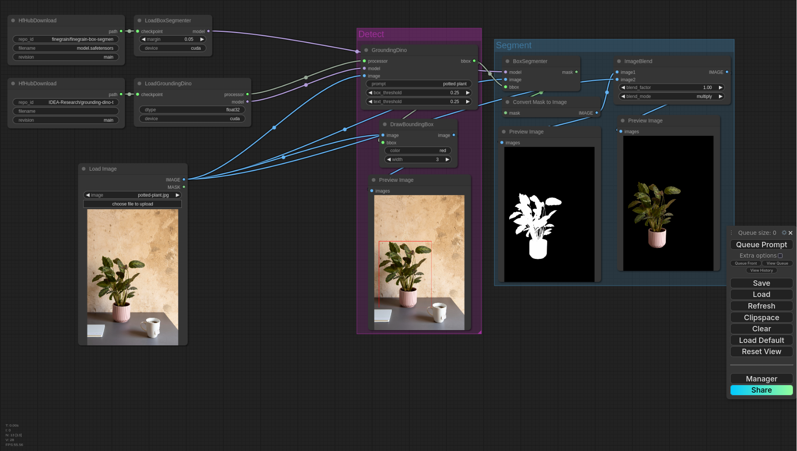

<picture>
  <source media="(prefers-color-scheme: dark)" srcset="https://raw.githubusercontent.com/finegrain-ai/refiners/main/assets/logo_dark.png">
  <source media="(prefers-color-scheme: light)" srcset="https://raw.githubusercontent.com/finegrain-ai/refiners/main/assets/logo_light.png">
  
</picture>

**The simplest way to train and run adapters on top of foundation models**

[**Manifesto**](https://refine.rs/home/why/) |
[**Docs**](https://refine.rs) |
[**Guides**](https://refine.rs/guides/adapting_sdxl/) |
[**Discussions**](https://github.com/finegrain-ai/refiners/discussions) |
[**Discord**](https://discord.gg/mCmjNUVV7d)

## Installation

The nodes are published at https://registry.comfy.org/publishers/finegrain/nodes/comfyui-refiners. See our [installation guide](https://refine.rs/guides/comfyui_refiners/) for more details.

## Example Workflows

### [Box Segmenter](assets/box_segmenter.json)

This simple workflow leverages GroundingDINO and our [BoxSegmenter](https://huggingface.co/finegrain/finegrain-box-segmenter) to extract objects from an image.

